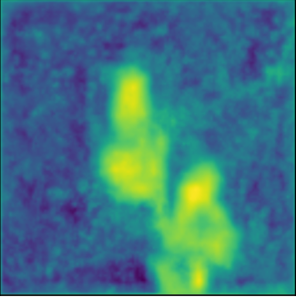

# Mapping Mining Areas in the Tropics

## Abstract
Mining provides crucial materials for the global economy and the climate transition, but has potentially severe adverse environmental and social impacts. Currently, the analysis of such impacts is obstructed by the poor availability of data on mining activity --- particularly in regions most affected.

In this paper, we present a novel panel dataset of mining areas in the tropical belt from 2016 to 2024. We use a transformer-based segmentation model, trained on an extensive dataset of mining polygons from the literature, to automatically delineate mining areas in satellite imagery over time.

The resulting dataset features improved accuracy and reduced noise from human errors, and can readily be extended to cover new locations and points in time as they become available.
Our comprehensive dataset of mining areas can be used to assess local environmental, social, and economic impacts of mining activity in regions where conventional data is not available or incomplete.

<p float="center">
  
   
  
</p>

## Getting started
1. Clone the repository.
   ```
   git clone -b main https://github.com/p0017/Mapping-Mining-Areas.git
   cd Mapping-Mining-Areas
   ```
2. Install the required Python packages.
   ```
   pip install -r requirements.txt
   ```
3. Download the ground truth, which is the union of mining polygons by [Maus et al.](https://www.nature.com/articles/s41597-022-01547-4) and [Tang and Werner](https://www.nature.com/articles/s43247-023-00805-6).
   ```
   cd data
   wget https://owncloud.wu.ac.at/index.php/s/QHr5K9w3HN97bJm/download/mining_polygons_combined.gpkg
   cd ..
   ```
4. Add your own API_KEY to segmentation_dataset_generation.py and check all paths.
5. Execute segmentation_dataset_generation.py for all years to create the datasets for training the model and prediction. A training dataset will only be generated for 2019 since the ground truth is based on this year. Prediction datasets will be generated for every year.
   ```
   for year in '2016' '2017' '2018' '2019' '2020' '2021' '2022' '2023' '2024'; do
     python3 segmentation_dataset_generation.py -year=$year &
   done
   ```
6. Download and install [MMSegmentation](https://mmsegmentation.readthedocs.io/en/main/get_started.html).
7. Follow the [instructions](https://mmsegmentation.readthedocs.io/en/main/advanced_guides/add_datasets.html) of MMSegmentation to add the 2019 mining dataset which you just generated to the training datasets.
8. Follow the [instructions](https://mmsegmentation.readthedocs.io/en/main/user_guides/4_train_test.html) of MMSegmentation to train an existing model of your choice on the 2019 mining dataset.
9. Add the path of your trained model to gpkg_dataset_generation.py and check all other paths.
10. Execute gpkg_dataset_generation.py for all years to get the gpkg datasets containing the predictions.
    ```
    for year in '2016' '2017' '2018' '2019' '2020' '2021' '2022' '2023' '2024'; do
     python3 gpkg_dataset_generation.py -year=$year -model='YOUR_MODEL' -iter='ITERATION_OF_YOUR_MODEL' &
    done
    ```
11. Postprocess your predictions.
    ```
    python3 gpkg_dataset_postprocessing.py
    ```
12. Redeem your postprocessed predictions.
     ```
    cd segmentation/data/segmentation/YOUR_YEAR/gpkg/
    ```
