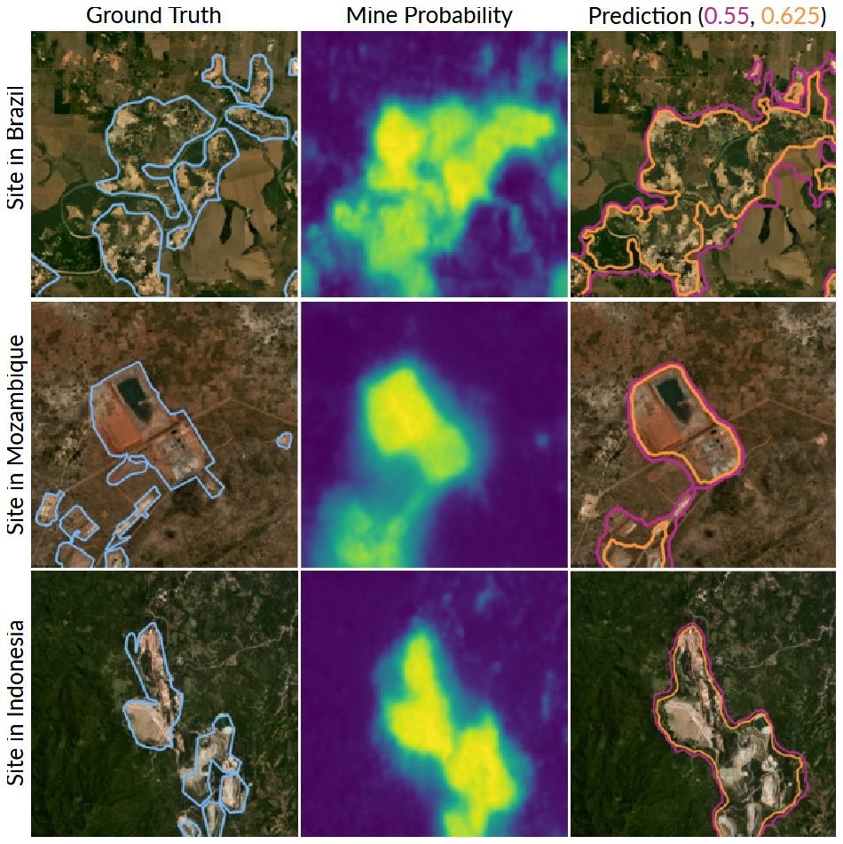

# Mapping Mining Areas in the Tropics

This repository provides instructions for creating a panel dataset of tropical mining areas using state-of-the-art semantic segmentation techniques, following our [study](https://doi.org/10.1038/s41893-025-01668-9):

<details>
  <summary>
    Sepin, P., Vashold, L., and Kuschnig N. (2025): Mapping Mining Areas in the Tropics from 2016 to 2024. Nature Sustainability.
  </summary>
  Mining provides crucial materials for the global economy and the energy transition but can have severe environmental and social impacts. Available analyses of these impacts are limited by a lack of data on mining activity, particularly in the regions most affected. Here we present a detailed panel dataset mapping mining sites along the tropical belt from 2016 to 2024. Our approach uses a machine learning model, trained on over 25,000 mining polygons from the literature, to automatically segment mining areas with high-resolution (<5 m) satellite imagery. The dataset maps over 147,000 mining polygons that cover an average area of 66,400 km2 annually, with an accuracy of 87.7% and precision of 84.1%. 
    Our approach allows accurate, precise and consistent delineation and can be scaled to other locations and periods. The dataset enables detailed analyses of local environmental, societal and economic impacts of mining in regions where conventional data are scarce or incomplete.
</details>

<p align="center">
  
</p>

---

## Getting Started
### 1. Clone the repository
   ```bash
   git clone -b main https://github.com/p0017/Mapping-Mining-Areas.git
   cd Mapping-Mining-Areas
   ```

### 2. Install required packages
Set up a *conda* environment. This can take a few minutes.
   ```bash
   conda env create -f environment.yml
   conda activate mining
   ```

### 3. Set up data access

Add your own [*Planet/NICFI*](https://www.planet.com/nicfi/) API key to the `.env` file under `API_KEY`.
Our ground truth dataset combines mining polygons from [*Maus et al.*](https://www.nature.com/articles/s41597-022-01547-4) and [*Tang and Werner*](https://www.nature.com/articles/s43247-023-00805-6) and is available [here](https://owncloud.wu.ac.at/index.php/s/QHr5K9w3HN97bJm/download/mining_polygons_combined.gpkg) or via the following command.
   ```bash
   cd data/segmentation/
   wget https://owncloud.wu.ac.at/index.php/s/QHr5K9w3HN97bJm/download/mining_polygons_combined.gpkg
   cd ../../
   ```

*Note:* You may also use other `.gpkg` polygon datasets, provided they are covered by Planet/NICFI. Ensure the file path is updated, and that the dataset is large enough to use for training.

*Note:* The Planet NICFI program is scheduled to be discontinued on January 23, 2025. As a result, the scripts below may not work as expected after this date.

### 4. Generate segmentation datasets
Generate image data for training and prediction by running the following command for each year.
The 2019 data will be used for training, with segmentation masks created exclusively for this year. Images are  generated for all years to enable prediction.
The images and segmentation masks can be found at `/data/segmentation/YOUR_YEAR/img_dir/` and `/data/segmentation/2019/ann_dir/` respectively.

There are two modes:

- **Regular Mode**: Processes the *complete dataset*, which can take one to two days.
   ```bash
   for year in '2016' '2017' '2018' '2019' '2020' '2021' '2022' '2023' '2024'; do
     python3 0_segmentation_dataset_generation.py --year=$year &
   done
   ```
- **Demo Mode**: Processes a smaller *demo dataset*. Demo mode is useful for testing and debugging.
   ```bash
   for year in '2016' '2019' '2024'; do
     python3 0_segmentation_dataset_generation.py --year=$year --demo='True' &
   done
   ```

*Note:* You may choose to run on a subset of sample years, but should always include 2019, which is required for training.

*Note:* The composite satellite images are selected based on their clarity, as stored in `data/segmentation/cloudfree_quads_info.csv`. Scripts to obtain this metadata are located in `scripts`.

*Note:* The training and validation sets are also available via [kaggle](https://kaggle.com/datasets/dcb263e024a0bf098a697d291d55eaedb5f1549bfc3a29760e04d598603934b3).

### 5. Set up *MMSegmentation*
Follow the installation guide for [*MMSegmentation*](https://mmsegmentation.readthedocs.io/en/main/get_started.html).
Add the 2019 mining dataset you generated to the *MMSegmentation* training datasets as per these [instructions](https://mmsegmentation.readthedocs.io/en/main/advanced_guides/add_datasets.html). Our model checkpoint and configs are available [here](https://owncloud.wu.ac.at/index.php/s/QkbGDSpbJMy3iEK) or via the following command.
   ```bash
   wget https://owncloud.wu.ac.at/index.php/s/QkbGDSpbJMy3iEK
   ```

### 6. Install *NVIDIA CUDA*
Processing and training relies on an *NVIDIA* GPU with *CUDA* support. Training benefits from two or more high-performance GPUs (such as the NVIDIA A30); a single GPU is sufficient for prediction.
To install *CUDA*, follow these [instructions](https://docs.NVIDIA.com/cuda/cuda-installation-guide-linux/).

*Note:* It may still be possible to achieve results on less performant GPUs when smaller segmentation models are used.

### 7. Train the model
Train your selected model on the 2019 mining dataset using *MMSegmentation* by following these [instructions](https://mmsegmentation.readthedocs.io/en/main/user_guides/4_train_test.html). Training may take a few days, depending on the model complexity and the size of the dataset. 

*Note:* The demo dataset is too small for effective model training.

### 8. Generate predicted polygons
Add your model configuration and checkpoints to the `.env` file under `MODEL_CONFIG` and `MODEL_CHECKPOINT`. You can customize the predictions by adjusting the threshold, which determines the *'probability of mine'* at the model output for classifying a pixel as part of a mining area. For example, a threshold of `0.6` would result in smaller polygons with fewer false positives but more false negatives, while a threshold of `0.4` would produce larger polygons with more false positives but fewer false negatives. A threshold of `0.5` offers a balanced choice, but the ideal threshold depends on your specific use case.

To generate a `.gpkg` dataset with predicted polygons for each year, run the script in one of the following modes:
- **Regular Mode**: Predict on the full `.gpkg` dataset, which can take one to two days.
    ```bash
    for year in '2016' '2017' '2018' '2019' '2020' '2021' '2022' '2023' '2024'; do
      python3 1_gpkg_dataset_generation.py --year=$year --threshold=0.5 &
    done
    ```
- **Demo Mode**:  Predict on a demo dataset.
    ```bash
    for year in '2016' '2019' '2024'; do
      python3 1_gpkg_dataset_generation.py --year=$year --threshold=0.5 --demo='True' &
    done
    ```

### 9. Postprocess the Predictions
Run the post-processing script to refine the predictions. This step is performed on the CPU and typically takes only a few minutes. You can customize the behavior of the post-processing by adding a buffer and setting its size. Post-processed predictions can be accessed in `data/segmentation/data/segmentation/YOUR_YEAR/gpkg/`.

There are different modes:
- **Regular Mode**: Executes without a buffer around mine polygons to avoid polygons popping up in isolated locations. 
  ```bash
  python3 2_gpkg_dataset_postprocessing.py
  ```
- **Using Buffer**: Specify a buffer size of your choice. In this case, using a buffer size of approximately 100 meters.
  ```bash
  python3 2_gpkg_dataset_postprocessing.py --buffer_size=100
  ```

---

## Acknowledgements
We acknowledge financial support from the Oesterreichische Nationalbank (OeNB anniversary fund, project no. 18799; N.K., L.V. and P.S.) and the City of Vienna (Hochschuljubiläumsfonds, project no. H-457973/2023; L.V. and P.S.). Data access under the NICFI Satellite Data Program enabled this research. Computations were performed on the WUCluster, a facility supported by the Core Services of the Vienna University of Economics and Business.
